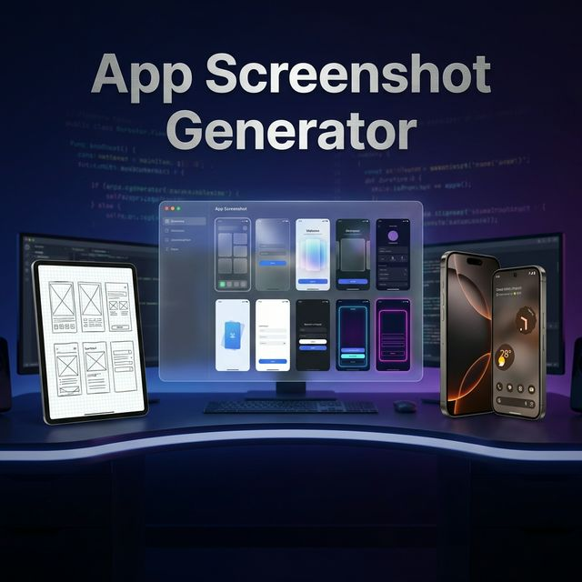

<div align="center">



# App Screenshot Generator Skill

### Drop your screens. Get store-ready assets.

<a href="https://opensource.org/licenses/MIT"></a>
<a href="https://www.python.org/downloads/"></a>

**No Figma. No templates. Just results. Targeting the Indies.**

> [!NOTE]
> Tools like Antigravity do not generate images with a 9:16 aspect ratio yet. But no worries—just generate your screenshots here, and later go to the ChatGPT or Gemini app and have them resize (to aspect ratio required) without messing up the design of the screenshots.

---

<br>

<h2>✨ Magic in Minutes</h2>

Turn raw, ugly screenshots into **cinematic, store-ready marketing assets**.

| **You Upload** | **AI Agent Generates** |
|:---:|:---:|
| 🖼️ Raw Screenshots | 🎨 Cinematic Mockups |
| 📝 Zero Context | ✍️ Marketing Copy |
| ⏱️ 2 Minutes | 🚀 Store-Ready Assets |

<br>

<h2>🎨 Choose Your Vibe</h2>

Don't settle for generic. Pick a style that fits your brand.

| Style | Mood | Best For |
|:-----:|:----:|:--------:|
| `glassmorphism` | Crystal, premium, depth | Fintech, Crypto, Modern SaaS |
| `minimalist` | Satin finish, museum-clean | Productivity, Notes, Utilities |
| `dark_futuristic` | Neon, wet floor, cyberpunk | Gaming, Developer Tools |
| `3d_playful` | Clay, soft lighting, vibrant | Kids Apps, Social, Lifestyle |
| `ethereal_bokeh` | Dreamy, spiritual, soft | Yoga, Meditation, Wellness |
| `aurora_gradient` | Flowing, alive colors | Music, Streaming, creative |
| `neumorphism` | Soft UI, organized calm | Task Managers, Banking |

<br>

<h2>📱 Supported Devices</h2>

> iPhone 16 Pro • iPhone 15 Pro • Samsung S24 Ultra • Pixel 9 Pro • OnePlus 12 • iPad Pro

*(Plus any custom device you can name)*

<br>

<h2>🧠 Brains Behind The Beauty</h2>

This isn't just a wrapper. It's a deterministic prompt engine that enforces design rules:

| Step | Action |
|:---:|:---|
| **1. ANALYSIS** | AI scans each uploaded image to understand the feature. |
| **2. MAPPING** | It maps 'Home Screen' -> 'Your Day at a Glance' headline. |
| **3. COMPOSING** | Enforces 65% device visibility (no tiny phones!). |
| **4. RENDERING** | Generates consistent lighting, shadows, and textures. |

<br>

<h3>The Iron Rules 🛡️</h3>

Every generated image is strictly guarded by these constraints:

❌ **No Text Overlap**: Text never touches the UI.<br>
📐 **Device Dominance**: Phone must fill 65%+ of the frame.<br>
🧹 **Zero Clutter**: No random flying 3D objects.

</div>

<br>

## 🚀 Get Started

### 1. Install
Copy the skill to your agent's brain:
```bash
cp -r app-screenshot-generator/ ~/.your-agent/skills/
```

### 2. Run
Just tell your agent:
> *"Generate Play Store screenshots for my app"*

### 3. Profit
Receive a folder of high-res, 9:16 PNGs ready for upload.

<br>

## 🗂 Under the Hood

```text
app-screenshot-generator/
├── SKILL.md                  # The Brain (Agent Instructions)
├── scripts/
│   └── prompt_generator.py   # The Engine (Python Logic)
└── references/
    ├── design_trends_2025.md # The Style Guide
    └── story_arcs.md         # The Narrative
```

<br>

## 📄 License

MIT — Build, ship, fork, sell. Usage is free.

---

<div align="center">

**Stop struggling with screenshots.**

*Your app deserves better.*

</div>
